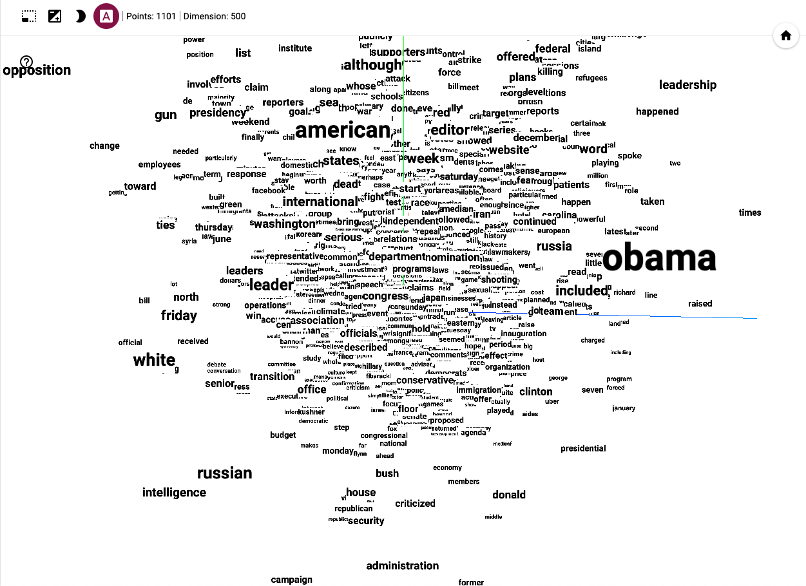

# CBOW and Skip-Gram Models using Tensorflow


### Importing Libraries
```python
import numpy as np
import pandas as pd
import yaml
import os
import io
import datetime

import nltk
from nltk.tokenize import word_tokenize
from nltk.tokenize import sent_tokenize
from nltk.corpus import stopwords

import tensorflow as tf
from tensorflow import keras
from tensorflow.keras import layers
from tensorflow.keras.layers import Embedding, Input, Dense, Dropout
from tensorflow.keras.models import Model
from tensorflow.keras import losses, optimizers
from tensorflow.keras.activations import softmax

from itertools import islice

from sklearn.model_selection import train_test_split
```

### Loading Data


```python
df = pd.read_csv('articles1.csv')
print('------------------Head------------------')
print(df.head())
print('------------------Tail------------------')
print(df.tail())
```

# Setting Constraints for Filtering the Texts


```python
# Set `data_limit` zero (0) for processing all of the data.
data_limit = 3000
# If the fruquency count of a word is less than the `min_frquency_of_word` than it will be removed from the dictionary
min_frquency_of_word = 300 
window_size = 7
max_sentence_lenght = 1000
max_word_count = 100
min_word_count = 5
max_sentence = 1000

data_info = {}
data_info['data_limit']= data_limit
data_info['min_frquency_of_word'] = min_frquency_of_word
data_info['window_size'] = window_size 
data_info['max_sentence_lenght'] = max_sentence_lenght
data_info['max_word_count'] = max_word_count 
data_info['min_word_count'] = min_word_count
data_info['max_sentence'] = max_sentence 
```


```python
section_texts = df['content'].apply(str)
```


```python
del df
```


```python
if data_limit != 0:
    section_texts = section_texts[:data_limit]
print('Total texts----->', len(section_texts))
```


```python
del data_limit
```

### Downloading `nltk` Resources for Data Processing 


```python
nltk.download('punkt')
nltk.download('stopwords')
```

### Converting Texts to Sentences


```python
sentences = []
for texts in section_texts:
    for sentence in sent_tokenize(texts):
        if len(sentence) < max_sentence_lenght:
            sentences.append(sentence.lower())
```


```python
total_sentences = len(sentences)
print('Total sentences', total_sentences)
```


```python
del texts
del section_texts
del max_sentence_lenght
del sent_tokenize
```

### Filtering out the Sentences, Converting Sentences to Words and Creating Vocabulary with Frequency

For filtering out-
<ul>
  <li>Remove the <b>stop words</b>.</li>
  <li>Remove the word if it is not an <b>alpha</b>.</li>
  <li>Remove the word if number of character is less than <b>one</b>.</li>
  <li>Remove sentences if word count is greater than <b>max_word_count</b> or less than <b>min_word_count</b></li>    
</ul>


```python
stop_words = set(stopwords.words('english'))
word_list = []
vocabulary_with_frequency = {}

for sentence in sentences:
    words = word_tokenize(sentence)
    words_without_stop_words = [word for word in words if word.isalpha() and word not in stop_words and len(word) != 1]
    
    word_lenght = len(words_without_stop_words)
    if word_lenght <= max_word_count and word_lenght >= min_word_count:
        word_list.append(words_without_stop_words)
        
        for word in words_without_stop_words:
            if word not in vocabulary_with_frequency.keys():
                vocabulary_with_frequency[word] = 1
            else:
                vocabulary_with_frequency[word] += 1
                
```


```python
print(len(vocabulary_with_frequency))
```


```python
del stop_words
del stopwords
del sentences
del sentence
del words
del words_without_stop_words
del word_lenght
del word
del max_sentence
del max_word_count
del nltk
del word_tokenize
del total_sentences
```

#### Total Words and Vocabularies After Filtering


```python
total_sentences = len(word_list)

total_words = 0
for words in word_list:
    total_words += len(words)
print('Total words in corpus', total_words)
print('Vocabulary size', len(vocabulary_with_frequency))
```


```python
del words
```

### Sorting Vocabulary Based on Frequency Count


```python
sorted_vocabulary_with_frequency = sorted(vocabulary_with_frequency.items(), key=lambda x: x[1], reverse=True)
```

### Removing the Word Form the Dictioary if Frequency count is Less Than `min_frquency_of_word`


```python
sorted_vocabulary = {key: frequency for key, frequency in sorted_vocabulary_with_frequency if frequency > min_frquency_of_word}
```


```python
del sorted_vocabulary_with_frequency
del vocabulary_with_frequency
```

### Removing the Less Freuquent Word form Dictionary and Assigning Unique Id to Each Word

Also created two dictionaries-
<ul>
  <li><b>word_to_id:</b> to get word for a word id.</li>
  <li><b>id_to_word:</b> to get the id for word.</li>
</ul>


```python
word_to_id = {}
word_to_id[0] = 'PAD'
id_to_word = {}
id_to_word['PAD'] = 0
word_id = 1

for word in sorted_vocabulary:
    word_to_id[word] = word_id
    id_to_word[word_id] = word
    word_id += 1
print(list(islice(word_to_id.items(), 15)))
print('-------------------------------------')
print(list(islice(id_to_word.items(), 15)))
```


```python
del sorted_vocabulary
```

### Converting `word_list` to `word_id_list` for Expressign the Words by Unique Dincatioanry ID  
In this step I have also--
<ul>
  <li>Removed a word if that is not in the dictionary</li>
  <li>Removed a sentece if word count is less than the <b>min_word_count</b></li>
</ul>


```python
data_info['Total sentences before filtering'] = total_sentences
data_info['Total words before filtering'] = total_words

print('Total sentences before filtering', total_sentences)
print('Total words before filtering', total_words)
```


```python
sentece_word_ids = []
total_sentences = 0
total_words = 0

for words in word_list:
    filtered_words_ids = [word_to_id[word] for word in words if word in word_to_id.keys()]
    words_in_current_sentece = len(filtered_words_ids)
    
    if words_in_current_sentece >= min_word_count:
        total_sentences += 1
        total_words += words_in_current_sentece
        sentece_word_ids.append(filtered_words_ids)
        
print('--------------------------------------------')
print('Total sentences after filtering', total_sentences)
print('Total words after filtering', total_words)

data_info['Total sentences after filtering'] = total_sentences
data_info['Total words after filtering'] = total_words
```


```python
del words
del word_list
del min_word_count                     
del word_id  
del filtered_words_ids
```

## Untill Now 
<br> 
<b>sentece_word_ids:</b> Sentence wise word's id. <br>
<b>word_to_id:</b> Dictionary for getting the <b>word_id</b> for a <b>word</b>.<br>
<b>id_to_word:</b> Dictionary for getting the <b>word</b> for a <b> word_id</b>.<br>
</br>


```python
print('Total sentences', total_sentences)
print('Total words', total_words)
vocabulary_size = len(word_to_id)
print('Total unique words in dictionary', vocabulary_size)
data_info['Total unique words in dictionary'] = vocabulary_size
```

### Loading the GPU


```python
physical_devices = tf.config.list_physical_devices('GPU')
print(physical_devices)
tf.config.experimental.set_memory_growth(physical_devices[0], True)
```

### Helper Function for Saving and Loading the Model, Informatino

In every cases name will be `skip` for skip-gram model and `cbow` for CBOW model.<br>


```python
def get_path_name(name):
    if name == 'pair':
        return 'save/model_pair/'
    elif name == 'skip':
        return 'save/model_skip/'
    elif name == 'cbow':
        return 'save/model_cbow/'
    
def get_unique_file_name():
    return datetime.datetime.now().strftime("%Y-%m-%d_%H-%M-%S-%f")


def save_model(name, model, file_name):
    path = get_path_name(name)+'model/'
    
    if not os.path.exists(path):
        os.makedirs(path)
        
    if name == 'cbow':
        model.save(path+file_name+'/')
    else:
         model.save(path+file_name+'.h5')
            
            
def load_model(name, file_name):
    path = get_path_name(name)+'model/'
    
    if name == 'cbow':
        return keras.models.load_model(
            os.getcwd()+'/'+path+'/'+file_name+'/', custom_objects={"Average": Average, "custom_loss_function": custom_loss_function}
        )
    
    return tf.keras.models.load_model(path+file_name+'.h5', custom_objects={"custom_loss_function": custom_loss_function})


def get_model_list(name):
    path = get_path_name(name)+'model/'
    
    if os.path.exists(path):
        return os.listdir(path)
    
def save_info(name, file_name, data):
    path = get_path_name(name)+'data_info/'
    
    if not os.path.exists(path):
        os.makedirs(path)
            
    with open(path+file_name+'.yaml', 'w') as file:
        documents = yaml.dump(data, file, sort_keys=False)
    
    
def get_info_list(name):
    path = get_path_name(name)+'data_info/'
    
    if os.path.exists(path):
        return os.listdir(path)
        

def get_info(name, file_name):
    path = get_path_name(name)+'data_info/'
    
    if os.path.exists(path):
            with open(path+file_name+'.yaml') as file:
                return yaml.load(file, Loader=yaml.Loader)
```


```python
file_name = get_unique_file_name()
```

### Generate 2D `vocabulary_size` List for Getting the `one-hot` Vector for a Word Id

`one_hot` will work as a `lookup table` to get one-hot encoded vector for a `word_id`.


```python
one_hot = np.zeros((vocabulary_size,vocabulary_size))

for index in range(1, vocabulary_size):
    one_hot[index][index] = 1
```

# Processing Data for the CBOW and SKIP-GRAM Model

In `CBOW` and `SKIP-GRAM` models, will be needed the one-hot encoded `target word` and their corresponding one-hot encoded `context words`. And the size of the one-hot encoded vector will be `vocabulary_size`. 

One-hot encoded `target_id` and `context_ids` creating process. 

---<b>target_id: </b>Created a zeros vector of `vocabulary_size`. Then simply assigned the value `one(1)` to an index of the vector, if index number is equal to the `word_id`<br>
---<b>context_ids:</b> Created total `window_size * 2`(maximum) `context_ids` for a `word_id`. Then I have created one-hot vector for `context_ids`, using the similar way I have created one-hot vector for a `target_id`. Additionaly, I have also sum up all of the one-hot encoded `context_ids` vectors to a single one-hot encoded vector of size `vocabulary_size`. So, there is one vector of size `vocabulary_size`, for containing all of the `context_ids` of a `target_id`. Because in `CBOW` model, at input layer and in `skip-gram` model at output layer, I have to sum up the one-hot context vectors. Here I have precalcualted it here.
<br>


```python
def get_target_contexts(word_ids, window_size):
    target_id = []
    context_ids = []
    
    for ids in word_ids:
        for index, word_id in enumerate(ids):
            if not word_id:
                continue
                
            window_start = max(0, index - window_size)
            window_end = min(len(ids), index + window_size + 1)
            
            target_id.append(one_hot[word_id])
            
            zero_context_ids = np.zeros(vocabulary_size)
            for window_index in range(window_start, window_end):
                if window_index != index:
                    zero_context_ids[ids[window_index]] += 1
            context_ids.append(zero_context_ids)
            del zero_context_ids
            
    return target_id, context_ids
```


```python
del index                      
del min_frquency_of_word       
```


```python
target_id, context_ids =  get_target_contexts(sentece_word_ids, window_size)
data_info['Total target words'] = len(target_id)
```

### Splitting the Training and Testing Data. Taking 20% Data for Testing


```python
X_train_target_list, X_test_target_list, Y_train_contexts_list, Y_test_contexts_list = train_test_split(target_id, context_ids, test_size=0.2, random_state=42)
del target_id
del context_ids
Train_target = np.array(X_train_target_list, dtype=np.float16)
del X_train_target_list
Test_target = np.array(X_test_target_list, dtype=np.float16)
del X_test_target_list
Train_contexts = np.array(Y_train_contexts_list, dtype=np.float16)
del Y_train_contexts_list
Test_contexts = np.array(Y_test_contexts_list, dtype=np.float16)
del Y_test_contexts_list
```

# CBOW Model

In `CBOW` model our input will be the vector of `context_ids` to predict the `target_id`. So, `Train_contexts` will be our input and the target will be `Train_target`. 


```python
data_info_cbow =  data_info.copy()
```

### Extending Keras Layer for Taking the Average of Embeddings Layer

I have alredys sum up of the input vectors. So, in this layer I've just taking the average after multiplying the the input vector with weight matrix(input layer). 


```python
class Average(keras.layers.Layer):
    def __init__(self, units=32, input_dim=32):
        super(Average, self).__init__()

    def call(self, inputs):
        return tf.math.divide(inputs, window_size*2)
    
    @classmethod
    def from_config(cls, config):
        return cls(**config)
```

### Building the model for CBOW


```python
inp = Input(shape=(vocabulary_size, ))
x = Dense(350, name='w2v_embedding_cbow')(inp)
x = Average(200)(x)
x = Dense(vocabulary_size, activation='softmax')(x)

model_cbow = Model(inputs=inp, outputs=x)
model_cbow.summary()
```

### Fitting the CBOW Model


```python
def custom_loss_function(y_true, y_pred):
    return tf.reduce_mean(-tf.math.reduce_sum(y_true * tf.math.log(y_pred), axis=[1]))


training_started = datetime.datetime.now()
model_cbow.compile(loss=custom_loss_function, optimizer=tf.optimizers.SGD(learning_rate=0.9), metrics=['accuracy'])
history_cbow = model_cbow.fit(Train_contexts, Train_target, epochs = 30, batch_size=20, verbose=1, shuffle=True)
```


```python
training_end = datetime.datetime.now()
data_info_cbow['training time'] =  training_end - training_started
data_info_cbow['cbow model training history'] = history_cbow.history
```

### Saving CBOW Model


```python
save_model('cbow', model_cbow, file_name)
```

### Testing CBOW Model


```python
loss, accuracy = model_cbow.evaluate(Test_contexts, Test_target, verbose=2)
```


```python
data_info_cbow['cbow model evaluatation loss'] = loss
data_info_cbow['cbow model evaluatation accuracy'] = accuracy
print('Evaluated loss',loss, 'and accuracy', accuracy)
```

### Saving Information for CBOW Model

For Visualization, pleae upload the vector and metadata from `save/model_cbow/vector_metadata` to https://projector.tensorflow.org 


```python
save_info('cbow',file_name, data_info_cbow)
```


```python
weights_cbow = model_cbow.get_layer('w2v_embedding_cbow').get_weights()[0]

path_cbow = get_path_name('cbow') + 'vector_metadata/'


if not os.path.exists(path_cbow):
        os.makedirs(path_cbow)

out_v = io.open(path_cbow+file_name+'vectors.tsv', 'w', encoding='utf-8')
out_m = io.open(path_cbow+file_name+'metadata.tsv', 'w', encoding='utf-8')

for index in range(1, vocabulary_size):
    vec = weights_cbow[index]
    out_v.write('\t'.join([str(x) for x in vec]) + "\n")
    out_m.write(id_to_word[index] + "\n")
out_v.close()
out_m.close()
```


```python
print('End of CBOW model!')
```


```python
del accuracy                   
del custom_loss_function       
del data_info_cbow            
del history_cbow              
del index                      
del inp                       
del model_cbow                 
del out_m                      
del out_v                     
del path_cbow                  
del train_test_split          
del training_end              
del training_started           
del vec                        
del weights_cbow               
del words_in_current_sentece   

```

## SKIP-GRAMS


```python
data_info_skip = data_info.copy()
```

### Creating SKIP-GRAMS Model


```python
inp = Input(shape=(vocabulary_size, ))
x = Dense(500, name='w2v_embedding_skip', bias_initializer=tf.initializers.RandomNormal(stddev=1.0))(inp)
x = Dense(vocabulary_size, bias_initializer=tf.initializers.RandomNormal(stddev=1.0), activation='softmax')(x)
model_skip = Model(inputs=inp, outputs=x)
model_skip.summary()
```

### Fitting Skip-Grams Model


```python
training_started = datetime.datetime.now()
```


```python
def custom_loss_function(y_true, y_pred):
    return tf.reduce_mean(-tf.math.reduce_sum(y_true * tf.math.log(y_pred), axis=[1]))


model_skip.compile(loss=custom_loss_function, optimizer=tf.optimizers.SGD(learning_rate=0.01), metrics=['accuracy'])
history_skip = model_skip.fit(Train_target, Train_contexts, epochs = 3, batch_size=40, verbose=1, shuffle=True)
```


```python
training_end = datetime.datetime.now()
data_info_skip['training time'] =  training_end - training_started
data_info_skip['skip-grams model training history'] = history_skip.history
```

### Saving SKIP_GRAM Model


```python
save_model('skip', model_skip, file_name)
```

### Testing SKIP_GRAM Model


```python
loss, accuracy = model_skip.evaluate(Test_target, Test_contexts, verbose=2)
```


```python
data_info_skip['skip model evaluatation loss'] = loss
data_info_skip['skip model evaluatation accuracy'] = accuracy
print('Evaluated loss',loss, 'and accuracy', accuracy)
```

### Saving Information for Skip-Gram Model


```python
save_info('skip',file_name, data_info_skip)
```

### Saving Vector and Metadata For SKIP-GRAM
For Visualization, pleae upload the vector and metadata from `save/model_skip/vector_metadata` to https://projector.tensorflow.org 


```python
weights_skip = model_skip.get_layer('w2v_embedding_skip').get_weights()[0]

path_skip = get_path_name('skip') + 'vector_metadata/'


if not os.path.exists(path_skip):
        os.makedirs(path_skip)

out_v = io.open(path_skip+file_name+'vectors.tsv', 'w', encoding='utf-8')
out_m = io.open(path_skip+file_name+'metadata.tsv', 'w', encoding='utf-8')

for index in range(1, vocabulary_size):
    vec = weights_skip[index]
    out_v.write('\t'.join([str(x) for x in vec]) + "\n")
    out_m.write(id_to_word[index] + "\n")
out_v.close()
out_m.close()
```

### Screenshots after Visualizing 
Visualization link https://projector.tensorflow.org

<!--  -->



```python
print('End Skip-Gram Model')
```

# Summary 

### CBOW Model


```python
cbow = load_model('cbow', file_name)
print(cbow.summary())
```


```python
get_info('cbow', file_name)
```

### Skip-Gram Model


```python
skip = load_model('skip', file_name)
print(skip.summary())
```


```python
get_info('skip', file_name)
```


```python
print('THE END')
```


```python

```

